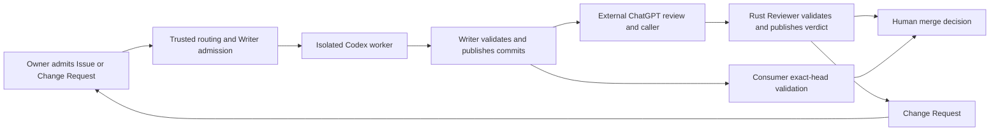

# Codex Relay

Codex Relay coordinates owner-authorized Codex work and independent review
through GitHub Issues and pull requests. It turns an admitted task or native
Change Request into an isolated implementation run, preserves useful commits,
and returns an exact PR head for review and a human merge decision.

It addresses the handoff between coding agents, reviewers and repository
owners: what may run, which commit was reviewed, what work survived a failure,
and whether publication actually happened. GitHub is the durable authority;
Relay supplies execution and publication mechanics.

It is for a **single human owner of a GitHub repository** who wants explicitly
launched Codex implementation, an external ChatGPT review conversation, and a
human merge decision. The owner chooses scope and launches work; the Codex
worker implements it; the Writer GitHub App publishes validated commits.
The external reviewer reads the diff and authors findings. The Rust **Reviewer
publication service** validates and publishes the supplied verdict or Change
Request; it does not perform substantive review or start a review model.

Here, independent review means a separate review session, identity and
credentials from the implementation worker/Writer, bound to an exact commit.
It does not mean a different vendor or an automatically provided human review.
Current Reviewer ingress authenticates the **OpenAI connector mTLS identity**;
arbitrary MCP clients are not supported.



A worker can diagnose, correct and validate repeatedly within one admitted
goal while each next action is justified by evidence. Unknown execution state,
ambiguous external mutation, missing authority or repetition without new
evidence stops the run. This is [progress-bounded execution](docs/execution-policy.md);
it does not enable automatic blind retries or nested workers.

## Status and scope

This is a pre-release product candidate with **no public release yet**. The repository contains the routing
controller, governed Codex runtime, trusted Writer publication code and Rust
Reviewer MCP service and the Relay-owned deployment implementation. Product
tests qualify local contracts; each installed consumer still needs independent
qualification of its configuration, Apps, workflows, ingress and runtime.

The automatic path supports same-repository PRs and explicit consumer
configuration. Fork code must never run on a persistent privileged consumer
runner. Ordinary public PR checks belong on GitHub-hosted runners; any future
dogfood installation needs a separately isolated, owner-controlled trusted
default-branch path. See the [public dogfood trust contract](docs/integration-reference.md#public-dogfood-trust).

Relay is not a replacement for Codex or CI, a hosted service, a deployment
framework, a model selector, a retry scheduler, or multi-owner/fork automation.

To install a consumer, supply a supported Linux target, trusted GitHub
routing/validation workflows,
separate Writer and Reviewer Apps, persistent protected state, and ChatGPT
custom-connector access with a reachable TLS/mTLS terminator and the trusted
OpenAI client CA. These are consumer/environment prerequisites. Relay installs
its users, fixed sudo wrappers, runtime and services through its deployment interface.

Codex Relay is licensed under the [MIT License](LICENSE).

## Try the local qualification

Use a Linux development environment with Node.js 22 or newer, Python 3, Git,
OpenSSL, and a Rust toolchain supporting the locked dependencies. See
[tested versions](CONTRIBUTING.md#local-validation). The Node
components use built-in modules and need no npm dependency installation.
Use a native Linux filesystem (including inside WSL): consumer configuration
must have real POSIX permissions and must not be group/world-writable.
From the repository root:

```sh
npm test
cargo fmt --manifest-path reviewer/Cargo.toml --check
cargo test --manifest-path reviewer/Cargo.toml --locked
python3 scripts/qualify.py
```

Qualification uses generated temporary certificates, loopback mock GitHub,
temporary Git repositories and three synthetic consumers, including an inventory
API with its own Python/type/API validation names. It does not call
Codex or publish to GitHub. Cargo may download locked dependencies on the
first build. See [CONTRIBUTING](CONTRIBUTING.md) for ordinary human changes and
the complete local checks; no installed consumer, Apps or Codex account is
needed to contribute. [SECURITY](SECURITY.md) explains reporting boundaries.

## Integrate a consumer

1. Read the [architecture and trust boundaries](docs/architecture.md).
2. Start with the [consumer contract](consumer/README.md) and
   [synthetic configuration examples](examples/README.md). Select an accepted channel or explicit
   Relay revision and resolve the model/effort in consumer task authority.
3. Deploy the selected product using the
   [deployment interface](deploy/README.md), then follow the
   [integration/ABI reference](docs/integration-reference.md).
   Supply consumer configuration, trusted workflows, target properties and separate
   Writer/Reviewer App references. Relay installs the isolated runtime, fixed
   wrappers and services. Qualify the installed system before enabling launch commands.
4. Use the [routing and recovery contract](controller/README.md) for admission,
   the [Change Request contract](contracts/README.md) for remediation, and the
   [Reviewer service contract](reviewer/README.md) for exact-head verdicts.

Local contract qualification exercises product code against controlled fixtures.
Deployment validation must separately prove installed identity, isolation,
credentials, workflow restrictions and ingress. Neither a local PASS nor a
published verdict grants merge, release or production authority.

## Repository map

| Path | Responsibility |
| --- | --- |
| `controller/` | Owner launch routing, attempt journal, trusted Git import, Writer admission/publication/recovery |
| `runtime/` | Governed Codex execution, Issue parsing and semantic worker results |
| `contracts/` | Native executable Change Requests, owner Step synchronization and secret scan |
| `consumer/` | Explicit validated consumer configuration and portability fixtures |
| `reviewer/` | Rust MCP service, exact-head review/check publication and durable deduplication |
| `scripts/` | Credential-free local qualification and candidate checks |
| `deploy/` | Product deployment, revision reporting and internal replaceable backend |
| `examples/` | Plain synthetic configuration and secondary rendering examples |
| `.github/ISSUE_TEMPLATE/` | Human bug/question paths and owner Codex task baseline |
| `.codex/hooks/` | Optional PowerShell Core developer helpers; see the [contract and qualification](.codex/hooks/README.md) |

The Node directories form one qualified product tree, not independently
published npm packages. `contracts/` owns the shared CR protocol; its JSON
definition stays in `reviewer/src/` for Rust inclusion and Node reads the same
file. Cross-directory imports are intentional; ship and qualify the whole tree.
