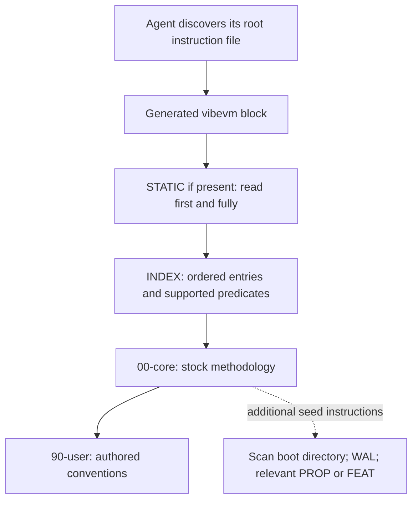
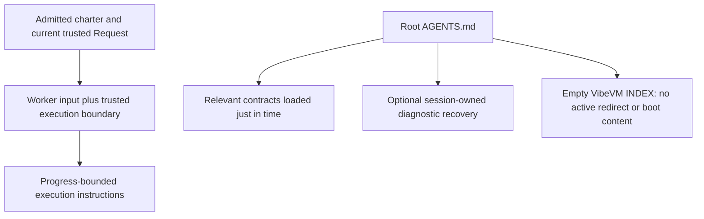
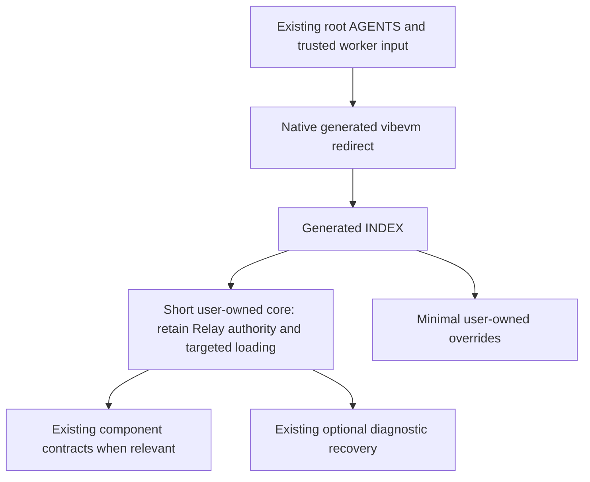

# VibeVM 1.0.7 native routing assessment

Task [#99](https://github.com/jresearchsoftware/codex-relay/issues/99), Step 1.
Historical investigation and disposable qualification only; Step 1 activated no
integration. The separately authorized Step 2 implements
[bounded native route C](vibevm.md). Comparisons and recommendations below record
the Step 1 baseline, not the later active source configuration.
Relay comparison baseline: `af3915d68ff70c9df04db2e610983f79d9597c73`.
The Issue remains open for owner architecture disposition, independent review,
and any separately authorized successor Request.

## Executive findings

- **Native file routing works without dependencies or a session-time binary.**
  Hash-pinned stock init generated three managed agent redirects and an INDEX
  referencing two small authored boot files. Offline regeneration reproduced
  the prompt bytes. This is a real tool result, not proof that Codex follows it.
- **The stock methodology is seed text, not an inseparable routing engine.**
  `00-core.md` contains WAL startup, specification precedence and broad loading
  instructions. It and `90-user.md` are explicitly user-owned. Editing their
  contents is supported; repeat init and reinstall preserved our replacements.
  No undocumented suppression switch is needed to retain Relay authority.
- **Unmodified stock policy needs owner choices.** Its instruction to implement
  a disputed specification before reporting the disagreement conflicts with
  Relay when authority or the next material correction is uncertain. Its
  central per-session WAL and broad boot-directory reading also differ from
  Relay's optional recovery and targeted context loading. Some stock practices
  are useful or equivalent to Relay's; overlap alone is not a conflict.
- **Native routing is not semantic task selection or acceptance.** Both relevant
  and irrelevant sample tasks have the same unconditional boot references.
  A missing referenced file and a redirect pointing at an absent INDEX both
  passed `vibe check` with zero findings. `validate` writes local lifecycle
  state. Neither check establishes authority, model compliance or review.
- **Recommended next target: the complete native routing mechanism with bounded
  authored instructions (option C below).** This uses option A's generator,
  rather than a second hand-maintained routing engine, while retaining Relay's
  accepted authority and optional recovery model. It is a proposal, not adopted
  policy. Keep the present direct route until the owner authorizes the change.

No `org.jresearch.ai/development-governance` dependency, other real package or
redbook preset was installed, resolved, locked or materialized. The local
[proportional-controls rules](execution-policy.md#proportional-controls-and-operator-usability)
remain authoritative and unchanged.

## Evidence, pin and reproduction

The [accepted pin](../toolchain/vibevm.json) selects VibeVM **1.0.7**, upstream
revision `b6659978453f50e6d1d4d99626d70b980a2c5847`, and the Linux x86_64 musl
release binary. The downloaded binary was 69,220,496 bytes and matched SHA-256
`20d111df02eb28040ef4cb766bfcb0bde8ff4427b031f88f33eacb3711c3e240` before
execution; `--version` returned `vibe 1.0.7`. The source archive was fetched
from that exact revision and inspected locally, not from moving `main`.
The source inspection and binary experiments are separate evidence.

Two read-only source-research subagents were used within the admitted permission,
with requested `gpt-6.1-sol` profiles at high and xhigh effort. The admitted parent
profile was `gpt-6.1-sol`/xhigh. Actual model/effort telemetry was not exposed:
**UNAVAILABLE**; requested values are not proof of actual runtime values.

Experiments ran on Linux x86_64 with Python 3.11.2. Each reusable probe makes
temporary projects and isolated HOME, configuration, settings and cache paths;
only PATH and locale variables are inherited. Every project command uses
`--offline`. No fixture obtains production authentication, installs host
dependencies, invokes a model, or changes the checkout's active entrypoints.

After downloading the exact binary in the pin to a disposable path:

```sh
python3 scripts/qualify-vibevm.py --vibe /absolute/disposable/path/vibe
python3 scripts/qualify-vibevm-routing.py --vibe /absolute/disposable/path/vibe
```

Both scripts recheck the digest. The [project probe](../scripts/qualify-vibevm.py)
qualified route B at Step 1; Step 2 updates it to qualify the actual bounded
route and human agent overlays.
The [new routing probe](../scripts/qualify-vibevm-routing.py) exercises stock and
bounded native routes, emits command results and factual inventories as JSON,
and removes its temporary projects. It does not download anything or become a
new mandatory validation gate. Its literal file traversal is explicitly **not
a Codex emulator**. Reproduction needs the pinned binary; reading committed
prompt content does not.

### Pinned source map

All upstream references below are immutable links to the accepted revision.
Paths and line numbers let a reader separate generated policy, generator
capability and this report's inference.

| ID | Source and relevant implementation |
| --- | --- |
| S1 | [Core template](https://github.com/vibevm/vibevm/blob/b6659978453f50e6d1d4d99626d70b980a2c5847/crates/vibe-cli/templates/boot-00-core.md), lines 3–39: complete stock project seed policy |
| S2 | [User template](https://github.com/vibevm/vibevm/blob/b6659978453f50e6d1d4d99626d70b980a2c5847/crates/vibe-cli/templates/boot-90-user.md), lines 3–6: authored project conventions |
| S3 | [Init implementation](https://github.com/vibevm/vibevm/blob/b6659978453f50e6d1d4d99626d70b980a2c5847/crates/vibe-cli/src/commands/init/mod.rs), lines 233–326, and [helpers](https://github.com/vibevm/vibevm/blob/b6659978453f50e6d1d4d99626d70b980a2c5847/crates/vibe-cli/src/commands/init/helpers.rs), lines 132–175, 212–231: seed authoring, generation, preserve existing files |
| S4 | [Managed redirects](https://github.com/vibevm/vibevm/blob/b6659978453f50e6d1d4d99626d70b980a2c5847/crates/vibe-workspace/src/boot_artifacts/redirect.rs), lines 26–70, 190–270: fixed filenames, pure reads, marker insertion/replacement |
| S5 | [INDEX renderer](https://github.com/vibevm/vibevm/blob/b6659978453f50e6d1d4d99626d70b980a2c5847/crates/vibe-workspace/src/boot_artifacts.rs), lines 111–206, 515–550: TOML schema, read-timing kinds, preparation and root fingerprint limit |
| S6 | [Boot composition](https://github.com/vibevm/vibevm/blob/b6659978453f50e6d1d4d99626d70b980a2c5847/crates/vibe-workspace/src/boot.rs), lines 19–35, 303–375, and [authored-file discovery](https://github.com/vibevm/vibevm/blob/b6659978453f50e6d1d4d99626d70b980a2c5847/crates/vibe-workspace/src/install/bootgen.rs), lines 327–389: bands, link precedence, local filenames |
| S7 | [Boot configuration](https://github.com/vibevm/vibevm/blob/b6659978453f50e6d1d4d99626d70b980a2c5847/crates/vibe-core/src/manifest/document.rs), lines 394–415; [package boot declaration](https://github.com/vibevm/vibevm/blob/b6659978453f50e6d1d4d99626d70b980a2c5847/crates/vibe-core/src/manifest/package.rs), lines 368–412, 506–547; [condition grammar](https://github.com/vibevm/vibevm/blob/b6659978453f50e6d1d4d99626d70b980a2c5847/crates/vibe-core/src/manifest/package/when.rs), lines 12–23, 71–109 |
| S8 | [WAL absence check](https://github.com/vibevm/vibevm/blob/b6659978453f50e6d1d4d99626d70b980a2c5847/crates/vibe-check/src/checks/wal_wellformed.rs), lines 60–68; [freshness](https://github.com/vibevm/vibevm/blob/b6659978453f50e6d1d4d99626d70b980a2c5847/crates/vibe-check/src/checks/wal_freshness.rs), lines 24–74; [check implementation](https://github.com/vibevm/vibevm/blob/b6659978453f50e6d1d4d99626d70b980a2c5847/crates/vibe-cli/src/commands/check.rs), lines 32–61, 195–216 |
| S9 | [Reinstall](https://github.com/vibevm/vibevm/blob/b6659978453f50e6d1d4d99626d70b980a2c5847/crates/vibe-cli/src/commands/reinstall.rs), lines 4–25; [regeneration](https://github.com/vibevm/vibevm/blob/b6659978453f50e6d1d4d99626d70b980a2c5847/crates/vibe-cli/src/commands/reinstall/regenerate.rs), lines 62–145; [lifecycle bootstrap](https://github.com/vibevm/vibevm/blob/b6659978453f50e6d1d4d99626d70b980a2c5847/crates/vibe-orchestrator/src/phase.rs), lines 305–312, 493–502 |
| S10 | [Artifact transaction](https://github.com/vibevm/vibevm/blob/b6659978453f50e6d1d4d99626d70b980a2c5847/crates/vibe-workspace/src/boot_artifacts/transaction.rs), lines 158–246, 274–293: lock, recovery intent and ordered publication |

## What full no-dependency init actually creates

The fixture used `init . --type project --name routing-fixture --version 0.0.0
--no-registry --author 'Synthetic fixture'`. This is the full stock **project**
initializer, not Relay's filtered scaffold and not an optional discipline pack.
The JSON result reported ten created outputs. The persistent transaction lock
is an additional filesystem artifact.

```text
project/
├── AGENTS.md / CLAUDE.md / GEMINI.md   generated managed redirect in each
├── vibe.toml                         [project] only
├── vibe.lock                         schema-7 [meta] only; no packages
├── .gitignore                        local state/control/editor ignores
├── .vibe/.gitignore                  local state directory ignored
└── vibevm/vibespecs/
    ├── boot/
    │   ├── 00-core.md                user-owned seed
    │   ├── 90-user.md                user-owned overrides
    │   ├── INDEX.md                  generated TOML, despite .md suffix
    │   └── .vibe-boot-artifacts.lock  zero-byte persistent transaction lock
    └── common/ feats/ flows/ modules/ stacks/   empty directories
```

For this exact fixture, each redirect was 829 bytes and all three were
identical; core was 1,513 bytes, user 300, INDEX 737, manifest 85, lock 92,
root ignore 795 and local ignore 2. These are measured UTF-8 file sizes,
not token counts, latency or model cost. The two boot bodies total 1,813 bytes.
Project naming affects seed and manifest size.

There is **no WAL.xml or WAL.md, STATIC, dependency slot, Skill, hook, tool,
MCP configuration, registry declaration or model configuration**. Empty
directories may disappear from an ordinary Git clone without affecting the
generated two-file route. Later `validate` created `.vibe/lifecycle.lock` and
`.vibe/lifecycle.toml`, leaving authored/generated prompt bytes unchanged.
The lifecycle state is distinct from the WAL that the seed asks an agent to
maintain.

## Routes and instruction loading

### A: complete unmodified stock route



In the empty stock project, STATIC is absent and INDEX names core then user,
both with `kind = "static"`. The redirect is a textual request to the hosting
agent to read files. VibeVM does not perform Codex inference or dynamically
fetch that content during boot. Its CLI also exposes package management,
lifecycle, Skill projection, MCP inspection and queued agentic instructions;
those capabilities do not run merely because the managed block exists.
The binary's own help says its agentic explanation queues work for the hosting
agent rather than performing inference. No such model execution was exercised.

There are two different meanings of static/dynamic (S5–S7):

| Axis | Meaning at this revision |
| --- | --- |
| Dependency link type | Static links compose content into a generated STATIC lane. Dynamic links retain file references in INDEX. Local authored boot is linked by reference. |
| INDEX `kind` | An unconditional reference is emitted as `static`, meaning read directly. A predicate-bearing reference is `dynamic`, meaning conditional INCLUDE at boot. |

Thus a `static` INDEX entry does not prove STATIC composition. An unconditional
dynamic dependency link does not give task-sensitive lazy loading either.
The supported predicates are operating system and installed-package membership,
not keywords, file relevance, Task number or authority. Installed predicates
are resolved during generation; false contributions are omitted. OS predicates
remain in INDEX and force dynamic linking even if a static link was requested.
Package compilation and conditional client traversal were source-inspected,
**not package-qualified or model-tested** in this no-dependency execution.

The core's separate instruction to read the boot directory in filename order
does not express the same routing as STATIC-first plus ordered/conditional INDEX.
It can imply extra or repeated reads and bypass predicates if taken literally.
That is an observed textual inconsistency (S1 versus S4), not a demonstrated
Codex failure. Replacing the authored core removes the competing instruction;
changing the generated block is unnecessary.

### B: accepted Relay direct route



The current [AGENTS.md](../AGENTS.md) and
[GitHub-native contract](../contracts/README.md#github-native-task-authority)
define source truth and targeted loading. The
[task-authority assembler](../controller/src/task-authority.mjs) supplies the
charter, complete Request and selected contextual evidence. The
[attempt runtime](../controller/src/attempt-runtime.mjs) supplies the title,
resolved profile and no-publication boundary, and
[Codex runtime](../runtime/src/codex-runtime.mjs) appends the shared
[execution policy](execution-policy.md).
None of these paths calls VibeVM to route ordinary work.
The [accepted VibeVM scaffold](vibevm.md) remains passive.

Repository boot prose cannot become a trusted Request, relax the worker's
boundary, authorize deployment or substitute for Writer/Reviewer. Root and
subdirectory agent instructions and trusted local overlays retain their
existing client-dependent precedence; this investigation did not redefine
that precedence or inspect private/global configuration. Optional
[developer hooks](../.codex/hooks/README.md) preserve a bounded, session-owned
diagnostic frontier and revalidate live authority on recovery. They are not a
central Task ledger or a prerequisite for ordinary work.

### C: complete native mechanism, bounded Relay-authored policy



This is a **future target**, exercised only with synthetic authored text in
disposable copies. Existing Relay AGENTS bytes were kept outside the managed
block. Edited core/user text and additional sample boot files survived init
and two reinstalls exactly. No stock WAL or global precedence text had to be
left underneath a contradictory override. The fixture text illustrates the
supported ownership mechanism; it is not a complete authority specification
or an independently accepted integration draft.

Putting relevant and irrelevant manuals directly in `boot/` would load both
unconditionally. The fixture's tasks, “Explain this project's routing
conventions” and “Compute 2 + 2”, both have the same four boot references:
core, `20-relevant.md`, `30-irrelevant.md`, user. Detail files under common and
modules are not automatically added to INDEX. Choosing whether to follow a
pointer to those files is an agent instruction/judgment question, **unverified
here**. This experiment measures route reachability; it does not measure
task completion, model obedience, attention, or semantic relevance selection.

## Stock rules versus accepted Relay behavior

Statuses describe compatibility with Relay's **current** accepted contract,
not superiority, an implementation regression or Reviewer acceptance.

| Stock rule/mechanism | Status | Evidence and disposition |
| --- | --- | --- |
| User-owned project description, core and conventions (S1–S3) | Works; useful | Clear separation between authored policy and derived routing. Relay already separates consumer policy and product protocol. Use this authoring surface if native routing is adopted. |
| Read all boot files at session startup (S1, S4) | Conflicts when it broadens loading | Relay starts with AGENTS, current authority and exact facts, then loads detail just in time. Two small snippets are modest overhead; future boot growth is the material question. No automatic relevance filter exists. |
| Read relevant specifications before working (S1) | Works; largely redundant | Matches affected-contract loading. It does not require renaming Relay docs into PROP/FEAT or moving them into VibeVM's taxonomy. |
| Mandatory WAL read and per-session rewrite (S1) | Conflicting instruction; tool optional | Fresh init creates no WAL and missing WAL passes the checker (S8). A maintained project checkpoint would add synchronization and staleness obligations beyond Relay's optional session evidence. Do not manufacture one merely to satisfy seed prose. |
| Verify old WAL with human before destructive work (S1) | Useful idea; gate needs decision | Checking freshness is sensible. Relay instead refreshes live authority/Git facts and stops for actual uncertainty. A fixed-age confirmation can be redundant when those facts are known; adopting it would be a cost-bearing operator change. |
| Private human memory, volatile checkpoint, durable addressable spec (S1) | Works as a conceptual model | Stable addressable decisions are useful; Relay already promotes accepted reusable rules into canonical contracts. A central WAL is not necessarily the best continuity unit for concurrent Tasks/sessions. Contention risk is an inference, not a tested VibeVM race. |
| Treat code/tests as regenerable artifacts (S1) | Conditional tension | The seed does not command deletion. Interpreting it as permission to discard useful or unrelated work would violate Relay preservation. Addressable specs can help without making checked-in code disposable. |
| Sync-from-Code proposal before rewriting back to spec (S1) | Useful aim; blanket ceremony redundant | Protects deliberate code changes from stale specs. Relay already requires same-Task documentation and owner decisions for unauthorized material behavior. A new proposal step is unnecessary when current authority covers the correction. |
| Human > Spec > Tests > Code (S1) | Needs authority mapping | Human intent can govern, and tests may need correction to an authorized contract. But casual discussion, a boot file or a repository spec cannot replace the current trusted Request or expand its boundaries. This slogan alone does not define Relay authority. |
| Mark disputed spec, implement it anyway, report later (S1) | Conflicts for material uncertainty | Relay stops before mutation when authority, protected behavior or the next material correction is ambiguous. A REVIEW marker does not grant authority. Following an authorized choice despite a nonblocking preference disagreement can still be compatible. |
| User overrides may include style and deployment instructions (S2) | Works if informational and bounded | Useful tailoring. A command being documented grants no deployment permission. Late overrides also do not prove a model will disregard contradictory earlier policy; replace the authored conflict directly. |
| Pure committed file reads at boot (S4) | Works; useful | No session-time registry, network, binary or cache is needed when referenced bytes are present. This supports clean-clone readability without adding an operator startup command. |
| Managed root blocks preserve co-tenant text (S4) | Works in fixture; client behavior unknown | Existing AGENTS content was preserved. All three redirects are generated; client discovery, ordering and obedience were not model-tested. This is not an isolation or trust mechanism. |
| STATIC priority and INDEX predicates (S5–S7) | Supported; relevance unsupported | Useful deterministic package composition. A full STATIC lane is mandatory text loading, not an authority override. Conditions concern OS/package membership. No Task-aware or arbitrary local per-file predicate is supported. |
| Artifact transaction state (S10) | Useful maintenance mechanism | Locks/journal/stages support crash recovery while regenerating derived files. They are different from WAL/session policy. Source shows prepared bytes then ordered publication, not one atomic rename across every output. Crash recovery was not fault-injected here. |
| Vibe checks replace Relay checks/review | Does not work | Lint/manifest success does not establish source scanning, Request authority, exact-head independent acceptance or model behavior. The stale-route probes demonstrate a narrower linter boundary. |

These comparisons use the accepted
[architecture](architecture.md),
[execution policy](execution-policy.md),
[Task authority contract](../contracts/README.md#github-native-task-authority),
[documentation maintenance rule](../CONTRIBUTING.md#keep-workflow-documentation-current)
and hook contract. The current report/fixture introduces no material operator
contract change. Any active integration would require that gate to be assessed
under new canonical authority.

Optional packs are not stock init. The pinned
[first-project guide](https://github.com/vibevm/vibevm/blob/b6659978453f50e6d1d4d99626d70b980a2c5847/vibevm/vibepacks/org.vibevm.core/vibevm-docs/v1.0.0/vibevm/vibespecs/start/first-project.xml)
explicitly installs a redbook preset later. Upstream's own checked-in core/user
XML files also contain project-specific self-hosting conventions, not the
generic init templates. Neither was applied to Relay. Package adoption could
introduce additional methodology, extension execution and attribution rules;
those must be evaluated from the exact later accepted package bytes rather
than attributed to this empty scaffold.

## Supported customization and lifecycle limits

| Desired behavior | Supported 1.0.7 strategy | Limit or owner decision |
| --- | --- | --- |
| Retain native generator but omit stock WAL/global hierarchy | Replace user-owned core text; retain user file with minimal bounded text (S1–S3). | Tested preservation through init/reinstall. Changing effective Relay instructions still needs a separately authorized Request. |
| Omit a whole authored boot file | Remove it from the authored boot directory; reinstall recomputes INDEX (S6). | Tested: reinstall does not restore absent core, but **init does**. Retaining a bounded replacement is more durable across init. |
| Keep a manual outside mandatory boot | Store it outside top-level boot and point to it only when relevant. | No local per-file `when` or task filter. Agent relevance judgment remains unverified. |
| Change dependency static/dynamic behavior | Per-edge link declaration, package suggestion, then `[boot].default_link`, then dynamic fallback (S6–S7). | Controls composition, not semantic authority or WAL. No dependencies were tested. |
| Conditional package boot | Package `[boot_snippet].when` with supported OS/installed predicates (S7). | Not a generic predicate API for local authored files. Source-only evidence. |
| Disable conflicting policy text | Edit/replace the authored source, or decline the package that carries it. | There is no `disable_wal`, `omit_core`, local snippet exclusion or redirect-template override switch in `[boot]`; that table supports only `default_link`. |
| Preserve placement of a managed block | Move the whole block once; future generation preserves its position. | Documented in pinned [managed-block contract](https://github.com/vibevm/vibevm/blob/b6659978453f50e6d1d4d99626d70b980a2c5847/vibevm/vibespecs/modules/vibe-workspace/PROP-012-managed-redirect-block.xml), lines 76–86. Placement/attention is not a proven precedence guarantee; movement was not tested here. |
| Generate only a Codex redirect | No inspected supported selection switch; generator names all three files (S4). | New CLAUDE/GEMINI files are part of the owner decision. Hand-removing them after every generation creates a second maintenance layer. |
| Disable an extension or exclude a dependency | Supported graph/extension controls exist. | They target package/extension contributions, not core seed or fixed root redirects; not exercised or recommended as seed suppression. |

Native boot has no executable fallback. Absent STATIC is explicitly allowed;
missing INDEX or a named file has no documented automatic repair/fetch path
in the generated instructions (S4). Keep known-good committed artifacts and
diagnose missing files at maintenance time. Do not add a routine session repair
command as an inferred solution.

| Operation | Evidence level | Meaning and qualification limit |
| --- | --- | --- |
| `init --no-registry` | Executed offline | Full seeds/redirects, no registry or package; existing authored text and overlays preserved. Does not suppress methodology or routing. |
| `check` | Executed offline | Linter only. Missing WAL, absent referenced core, and clean's missing INDEX all yielded zero findings. Marker checks do not attest redirect body equality. |
| `validate` | Executed offline | Parsed empty world successfully; wrote lifecycle state. Installed validation contributions can execute in other worlds (S9), so do not generalize this probe into guaranteed read-only validation. |
| Plain `reinstall` | Executed offline | Reproduced derived files and preserved authored bytes without re-resolving. Missing INDEX/redirect repaired; missing core not recreated. In a populated workspace it can service parked work; it is not universally inert (S9). |
| `clean` followed by reinstall | Executed offline | Removed INDEX, retained seeds, lock and unchanged redirect blocks. The intermediate route was dangling; reinstall restored the original prompt bytes. |
| Install, scoped update, uninstall | Source-inspected only | Regenerate routing as package graph/content changes. These are maintenance mutations; no actual package operation was admitted or performed. |
| Forced reinstall | Source-inspected only | Refetches locked content without selecting new versions; distinct from plain regeneration. Not an offline fallback and not exercised. |
| Skill/MCP/agentic and other CLI surfaces | Help/source inspection only | Optional capabilities distinct from textual boot. No MCP registration, inference engine, credentials, deployment or runtime proof is implied by init. |

One pinned documentation discrepancy remains: the
[loading contract](https://github.com/vibevm/vibevm/blob/b6659978453f50e6d1d4d99626d70b980a2c5847/vibevm/vibespecs/modules/vibe-workspace/PROP-009-loading-model.xml)
lists XML core/user names as special categories, whereas S6's discovery matches
the Markdown names for those bands. XML input is supported, but equivalent
special ordering is not established. Use Markdown in a minimal next PR;
qualify XML semantics separately if needed.

## A/B/C tradeoffs

| Dimension | A: unmodified stock | B: current direct Relay | C: bounded native route |
| --- | --- | --- | --- |
| Routing owner | VibeVM generated block/INDEX | Relay AGENTS pointers; no active VibeVM route | Same native generator as A; small Relay-authored boot sources |
| Authority/model fit | Seed hierarchy/WAL must be accepted or reconciled | Accepted current behavior | Retains current semantic authority if correctly authored and separately accepted |
| Maintenance | Generator plus stock and user methodology | Existing contracts and pointers | Generator plus short bounded sources; no edited generated router |
| Future dependencies | Native composition available; new instructions/capabilities need review | Scaffold can resolve later; routing would need a deliberate change | Native composition already available; package adoption still separate |
| Clean clone/offline | Readable if generated files and named bytes committed | Current AGENTS/contracts readable; empty INDEX preserved | Same passive readability as A; no bootstrap command at session time |
| Default Codex workflow | Adds mandatory native boot and stock seed behavior | Current targeted context and optional hooks | Adds small mandatory boot; keeps detail loading targeted by instruction |
| Generated ownership | Managed blocks, INDEX/STATIC derived; seeds authored | Passive manifest/lock/empty INDEX; AGENTS authored | Managed blocks/INDEX derived; core/user authored; existing AGENTS outside block |
| Reproducibility | Stock bytes reproduced in fixture | Existing scaffold probe passed on tracked-file copy | Customized fixture bytes reproduced; final integration not yet implemented |
| Failure/rollback | Clean can leave dangling route; no boot fallback | No active route to repair | Same native lifecycle limits; ordinary Git revert of integration restores B |
| Demonstrated benefit | Consistent file composition, co-tenant preservation | No new startup or state obligation | Supported reuse of native generator without stock-policy migration |
| Unverified | Codex compliance, package conditions, crash recovery, runtime cost | This execution did not benchmark current Codex behavior | Same model/package gaps; preservation of final authority text requires independent review |

The bounded synthetic boot bodies measured 300 bytes, versus 1,813 stock bytes;
that comparison demonstrates configurable prompt size, **not** a production
token saving. It excludes root AGENTS, redirects, INDEX and task-selected
documents. No elapsed-time, inference-cost, maintainability-cost or accuracy
benchmark was measured. A two-file no-dependency project gives little immediate
composition benefit over B; native generation becomes more useful if later
approved dependencies contribute boot content. That prospective benefit is
not a reason to adopt a package or expand startup loading now.

## Recommended next PR and explicit owner decisions

Recommend **C as a bounded configuration of A's native mechanism**, while
keeping B active until owner authorization. It honors the preference for a
single native router without silently adopting an upstream methodology.
Manual authoring of policy in a documented user-owned file is not a parallel
manual implementation of INDEX generation.

A minimal separately admitted PR would:

1. Resolve a new exact starting head and complete Request after the owner's
   choice. Retain all existing protected boundaries, Writer/Reviewer separation,
   worker prompt authority, hooks and checks.
2. Add short Markdown core/user boot sources that identify existing Relay
   authority and targeted loading, without broad directory recursion, a WAL
   obligation, global hierarchy replacement or new approval ceremony. Keep
   substantive governance in its existing canonical documents and avoid a
   pointer that recursively reloads AGENTS/INDEX.
3. Generate INDEX and all managed root blocks with the pinned tool in isolation,
   then propose the reviewed bytes as ordinary source changes. Keep full
   existing AGENTS text outside the managed block. Do not patch the generated
   block/INDEX to invent suppression or task routing. Preserve the accepted
   empty lock; no real package is needed for this step.
4. Update `docs/vibevm.md` and its scaffold qualification in the same PR: their
   current assertions intentionally prohibit active redirects/core/user files.
   Use the existing checks and focused file-reachability/regeneration evidence;
   do not turn VibeVM into a new required session tool or acceptance authority.
5. Qualify a clean committed copy, offline regeneration, overlays and the
   simplest owner-facing path. If a suitably isolated credential-free actual
   client becomes available, test relevant/irrelevant traversal and conflict
   handling. Preserve an explicit gap otherwise. Run native exact-head checks
   and obtain independent review of both behavior and operator cost.
6. Document rollback as an ordinary Git revert restoring B's AGENTS, absence
   of auxiliary redirects and empty INDEX. Do not use `clean` as rollback: it
   leaves redirects. Any later package adoption needs its own complete Request,
   exact producer/distribution hashes and semantic ownership discussion.

The owner must explicitly choose:

- **Route:** keep B, accept bounded native C, or adopt the unmodified A
  methodology with the corresponding authority/recovery changes. No choice is
  pre-approved by this investigation.
- **Recovery:** retain optional per-session diagnostic evidence, or justify a
  new WAL policy, its ownership, concurrency, freshness and human-interruption
  costs. No demonstrated continuity gap here requires a second checkpoint.
- **Authority and disputed specs:** retain current stop/Decision rules or
  authorize a precise alternative. A blanket hierarchy slogan or late REVIEW
  marker cannot safely fill this decision.
- **Startup breadth and client surfaces:** accept bounded unconditional boot
  and all three generated root redirects, or defer until a supported narrower
  surface is available. Native route does not promise arbitrary semantic lazy
  loading. Avoid adding component manuals to mandatory boot by accident.
- **Later dependency/duplicate removal:** remain separate from this source-only
  routing decision and from Task #97's deferred shared-package phase. There is
  no automatic successor Step or adoption launch.

Upstream offers better reusable mechanics here: managed co-tenant blocks,
explicit authored/generated ownership and deterministic package composition.
Relay already has useful targeted context, live authority and optional recovery.
A native integration can retain both. Adopting broader spec-first/WAL practices
could also be a legitimate owner choice, but needs an evidenced benefit and
explicit migration rather than an inference from an installed file.

## Test record, limitations and warning disposition

The new probe completed **16 offline project commands** plus the version/digest
checks. Each command's JSON and exit status is emitted on reproduction; the
table records the substantive results without duplicating a CI ledger.

| Probe | Observed result | Evidence limit |
| --- | --- | --- |
| Empty stock init and inventory | Ten reported outputs plus persistent boot lock; no packages/WAL/STATIC | Tool/filesystem evidence; no model startup |
| Stock check and validate | Zero check findings; validation succeeds and creates two local lifecycle files | Not a policy or read-only-generalization proof |
| Repeated init and two reinstalls | Same manifest/lock/seeds/redirects/INDEX bytes | Local lifecycle state excluded from byte equivalence and reported separately |
| Empty authored boot after removing both seeds | Reinstall produces zero entries; generated redirects remain | Does not establish client fallback |
| Bounded core/user, human AGENTS and sample tasks | Human prefix preserved; custom sources retained; filename order verified; identical unconditional sample-task routes | No actual task/model execution or relevance selection |
| Missing core plus INDEX/redirect | Reinstall repairs generated files, omits absent core; subsequent init restores stock core | Supports bounded replacement rather than omission for durable customization |
| Stale INDEX after deleting referenced core | `check` exits zero, all finding counts zero | Demonstrated linter gap; not claimed as a new Relay regression |
| Clean with dangling redirects, then reinstall | Clean keeps redirects but removes INDEX; `check` still reports zero; reinstall restores prompt bytes | Intermediate route is unusable under literal redirect; model response unknown |
| State-free clone-like file copy | Same named boot files and bytes readable without `.vibe` or control locks | Passive file-read evidence; not a deployed clone/client bootstrap proof |
| Existing Relay scaffold probe | Structural and exact-binary probe PASS, including preserved overlays and empty-index regeneration | No package adoption or runtime qualification |

**Real Codex traversal is UNVERIFIED.** There is no `codex` executable on this
worker's PATH, and launching another governed/model execution or using owner
credentials is outside the boundary. This active Relay session is not an
isolated stock client experiment. Claude/Gemini client behavior, dynamic
package compilation, conditional client loading, paid inference, sandboxed host
integration and crash-recovery fault injection are likewise not qualified.
These gaps constrain the recommendation to supported file routing; they do
not justify inventing a behavioral PASS.

Normal candidate validation was attempted. `npm test` could not start because
npm is absent; available Node is 18.20.4 versus the repository's qualified
22.20.0/minimum 22. Deployment pytest could not start because pytest is absent.
Cargo fmt/tests could not start because Cargo is absent, and `scripts/qualify.py`
stopped at its required Cargo build for the same reason. No host dependencies
were installed to repair the environment. Both exact-binary Python probes
passed; Python syntax and all 21 immutable upstream source paths were checked.
Whitespace checks passed. `scripts/check-candidate.py` passed over 430 tracked
files and 254 local links, covering JSON syntax, local Markdown links and bounded
credential markers. These are the local proofs; native exact-head validation
after Writer publication must supply the unavailable normal proofs.

The stale-route and clean-route gaps are **pre-existing in the pinned upstream
behavior**, not introduced by this report or fixture. The initial fixture
expectations of an inert validate and redirect-removing clean were corrected
to the observed behavior; no product change was made to make them pass.
No adoption is blocked on an invented requirement that upstream behave
differently. The next owner/review decision must account for those lifecycle
limits if native routing is chosen.

Material execution limitations: normal-suite tooling and real-client proof are
unavailable in this worker. Required GitHub/runtime primary execution warning
surfaces cannot be inspected here under the no-credentials/no-Reviewer boundary;
there is **no absence-of-warnings claim**. Trusted Writer and independent review
must inspect supported exact-attempt Outcomes/check/job annotations and dispose
of material warnings under the existing
[warning policy](execution-policy.md#execution-warning-disposition). Local tool
success does not replace that disposition or independent acceptance.

Only this report and the opt-in isolated fixture are intended repository deltas.
No active agent file, INDEX, worker input, hook, production service or public
interface is changed. Implementation evidence is handed to trusted Writer via
ordinary local task commits; the worker does not publish, review itself, merge,
close the Issue or start package adoption.
